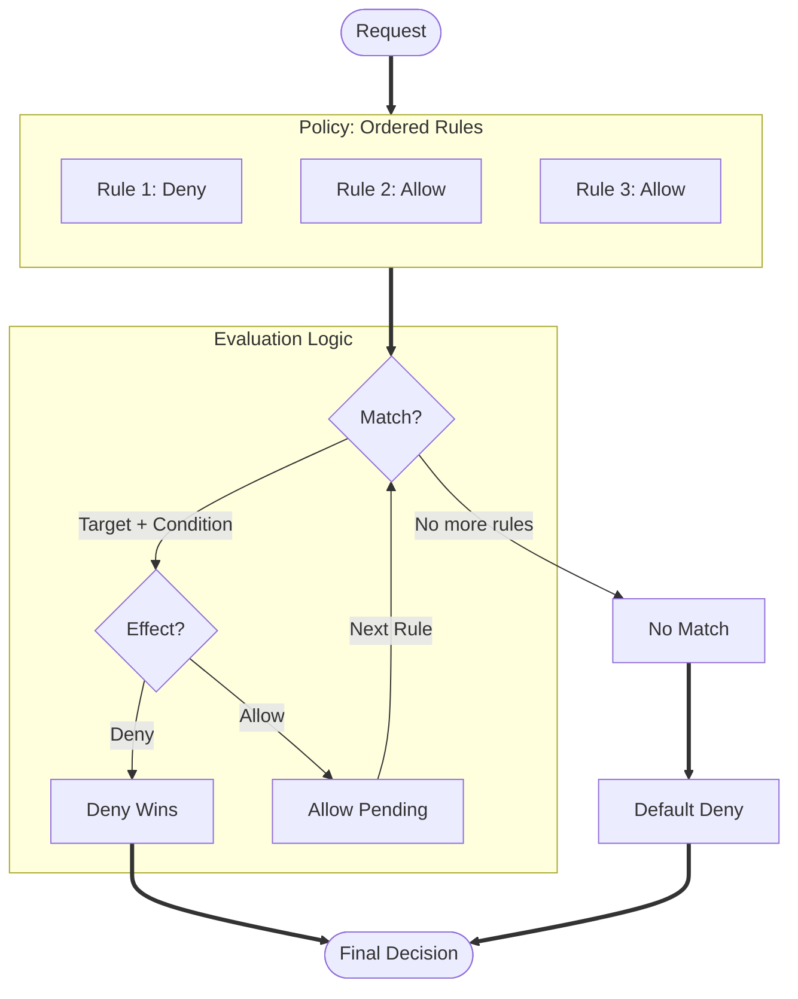

# gate0

[](https://github.com/Qarait/gate0/actions/workflows/ci.yml)
[](https://opensource.org/licenses/MIT)

A small, auditable, terminating, deterministic micro-policy engine.

## Security Model

Gate0 is designed for high-assurance environments where policy evaluation must be deterministic and resource-bounded. See [SECURITY.md](SECURITY.md) for the full threat model, system invariants, and mechanical guarantees.

## Architecture

Gate0 uses a linear, **Deny-Overrides** evaluation strategy. Each rule consists of a **Target** (fast-path match) and an optional **Condition** (deep logic).



## Verification

The correctness and safety of Gate0 are mechanically verified through unit tests covering core logic and edge cases, property-based testing via proptest with hundreds of generated scenarios, and MIRI verification for panic-free and UB-free operation. Worst-case inputs are tested to ensure bounded termination.

```bash
cargo test
cargo +nightly miri test --lib
```

## Safety and Cost Model

Gate0's evaluator uses fixed-size, stack-allocated buffers to guarantee zero heap allocations during evaluation. The default implementation uses `MaybeUninit` to avoid initializing unused slots, resulting in O(used) initialization cost rather than O(capacity).

The unsafe code is confined to a single module (`fixed_stack.rs`) with straightforward invariants: elements 0..len are initialized, elements len..N are not. All unsafe paths are verified with MIRI.

For users who prefer zero unsafe code, Gate0 provides `SafeFixedStack` behind the `safe-stack` feature flag. This variant uses `[T; N]` with `T: Default + Copy` and initializes all slots upfront. The tradeoff is O(capacity) initialization on every evaluation call.

```bash
cargo build --features safe-stack
```

Both implementations provide identical semantics and the same zero-allocation guarantee during evaluation. The choice is between performance (O(used)) and absolute safety (O(capacity)). For small stacks with cheap Default types like bool, the difference is negligible.


## Example

```rust
use gate0::{Policy, Rule, Target, Request, ReasonCode};

let policy = Policy::builder()
    .rule(Rule::allow(Target::any(), ReasonCode(1)))
    .build()?;

let decision = policy.evaluate(&Request::new("alice", "read", "doc"))?;
assert!(decision.is_allow());
```

## Examples

The `examples/` directory contains illustrative scenarios demonstrating common Gate0 usage patterns:

- **SaaS API**: Standard RBAC/Multi-tenancy logic.
- **Zero Trust Network**: Attribute-Based Access Control (ABAC) with MFA and location checks.
- **Complex Overrides**: Demonstrating Deny-Overrides conflict resolution.

Run them with:
```bash
cargo run --example saas_api
cargo run --example zero_trust_network
cargo run --example complex_overrides
```

## License

MIT
