# Security Model

Gate0 is a micro-policy engine. This document defines what it defends against, what it explicitly does not defend against, and the mechanical invariants it guarantees.

---

## Threat Model

### What Gate0 Defends Against

| Threat | Defense |
|--------|---------|
| Logic bugs in authorization | Explicit deny-overrides semantics, ordered evaluation, no implicit defaults |
| Ambiguous rule evaluation | Deterministic rule ordering, first-match-wins within effect class |
| DoS via unbounded input | Hard limits on rules, condition depth, and context size |
| Silent failure modes | All operations return `Result`, no panics in core logic |
| Inconsistent decisions | Same input always produces same output, no randomness |

### What Gate0 Does NOT Defend Against

| Non-Goal | Rationale |
|----------|-----------|
| Malicious policy author | Caller is trusted to construct valid policies. Gate0 enforces bounds, not intent. |
| Side-channel attacks | No countermeasures for timing, cache, or power analysis. |
| Timing attacks | Evaluation time varies with input. Not constant-time. |
| Compromised host | If the runtime is compromised, all bets are off. |
| Incorrect upstream identity | Gate0 trusts the `principal` field as provided. Identity verification is out of scope. |
| Policy correctness | Gate0 evaluates policies as written. It cannot detect semantic errors in policy logic. |

### Assumed Attacker Capabilities

| Capability | Assumed |
|------------|---------|
| Full control over request input | Yes |
| Ability to craft worst-case conditions | Yes |
| Ability to trigger repeated evaluations | Yes |
| Control over policy construction | No |
| Access to host memory or process | No |

---

## Security Architecture

Gate0 implements a three-stage defense pipeline to ensure that hostile input is caught before it can cause CPU or memory exhaustion.

```mermaid
flowchart LR
    subgraph Construction ["Stage 1: Construction (Static)"]
        direction TB
        C1[Check Rule Count]
        C2[Validate Matcher Limits]
        C3[Check Condition Depth]
        C4[Validate String Lengths]
    end

    subgraph Evaluation ["Stage 2: Evaluation (Dynamic)"]
        direction TB
        E1[Validate Request Strings]
        E2[Validate Context Size]
        E3[Stack-Safe Traversal]
        E4[Constant-Memory Logic]
    end

    subgraph Cleanup ["Stage 3: Cleanup"]
        direction TB
        L1[Stack-Safe Drop]
    end

    INPUT([Untrusted Input]) --> Construction
    Construction --> POLICY[(Bounded Policy)]
    POLICY --> Evaluation
    Evaluation --> DECISION([Safe Decision])
    DECISION --> Cleanup
```



## Invariants

Gate0 maintains several core invariants to remain defensible.

**Termination.** All evaluation logic is non-recursive and stack-based. Depth is checked at construction.

**Determinism.** Policy results are stable across identical requests and restarts.

**Memory Safety.** Zero use of `unsafe` in core library paths except for the `FixedStack` module, which is MIRI-verified. Zero leaks in evaluation paths.

**Resource Bounds.** Maximum rules per policy, maximum nesting in conditions, maximum attributes in request context, maximum items in OneOf lists, and maximum length of any identifier or value are all enforced at construction or evaluation time.

**Fail-Closed.** By default, any unmatched request or evaluation error returns Deny.

## Mechanical Proofs

**No Recursion.** Both validation and evaluation are implemented using manual stacks.

**Panic-Free.** All operations return `Result`. No unwrap, expect, or panic macros in core paths.

**Safe Destruction.** Manual, stack-based Drop implementation for Condition prevents overflows during cleanup.

**Zero Heap Allocations at Request-Time.** Policy::evaluate and Condition::evaluate use fixed-size, stack-allocated buffers via FixedStack with MaybeUninit.

## Zero-Allocation Guarantee

The evaluation hot-path performs zero heap allocations. Stack sizes are derived from the hard depth cap.

| Stack | Size Formula | Value (D=16) | Proof |
|-------|-------------|--------------|-------|
| Traversal | 2D + 2 | 34 items | Each And/Or pushes 1 op + 2 evals; worst case is left-leaning chain |
| Results | D + 2 | 18 items | Operators consume children before parent completes |

The hard cap is ABSOLUTE_MAX_CONDITION_DEPTH = 16. Configs exceeding this are rejected. Verification is performed in tests/allocations.rs which asserts zero allocations across 1000 iterations per test. All FixedStack and evaluator tests pass under MIRI with no undefined behavior.

## Bounds Enforcement

| Bound | Default | Enforced At |
|-------|---------|-------------|
| Max rules | 1000 | Policy construction |
| Max condition depth | 10 | Policy construction |
| Max context attributes | 64 | Evaluation time |

## Conflict Resolution

Deny always overrides Allow via deny-overrides semantics. Within the same effect class, first matching rule's reason is returned. No matching rules results in Deny with reason NO_MATCHING_RULE.

---

## Verification

### Automated Testing

Unit tests cover every module with isolated tests for individual functions. Integration tests exercise realistic policy scenarios in lib.rs. Property-based tests generate random inputs via proptest. Worst-case tests exercise maximum bounds in the test suite.

### Property-Based Testing Bounds

Property-based testing is intentionally bounded to prevent resource exhaustion during local runs.

| Parameter | Value | Rationale |
|-----------|-------|-----------|
| Test cases | 25 | Sufficient for adversarial coverage without memory pressure |
| Max condition depth | 5 | Stresses recursion without exponential explosion |
| Max rules per test | 20 | Exercises policy limits without allocation storms |
| Timeout per case | 10s | Generous for any single evaluation |

These bounds prove adversarial intent, not exhaustiveness. CI runs can increase PROPTEST_CASES for deeper coverage on machines with more resources.

### Panic-Free Verification

Core logic is searched for unwrap, expect, and panic. None are present in evaluation paths.

### Undefined Behavior Check

MIRI validates the library crate for undefined behavior.

```bash
cargo +nightly miri test --lib
```

This validates no undefined behavior, no invalid memory access, lifetime soundness, and no use-after-free or double-free. Property tests cannot run under MIRI due to proptest's filesystem requirements for regression persistence. This is a proptest limitation. The library tests provide full coverage of core logic.

---

## Out of Scope

The following are explicitly not part of Gate0's security model: cryptographic operations, network communication, persistence or caching, audit logging (caller responsibility), and policy serialization/deserialization.

Gate0 is a pure function: (Policy, Request) → Result<Decision, Error>

Everything else is the caller's responsibility.
