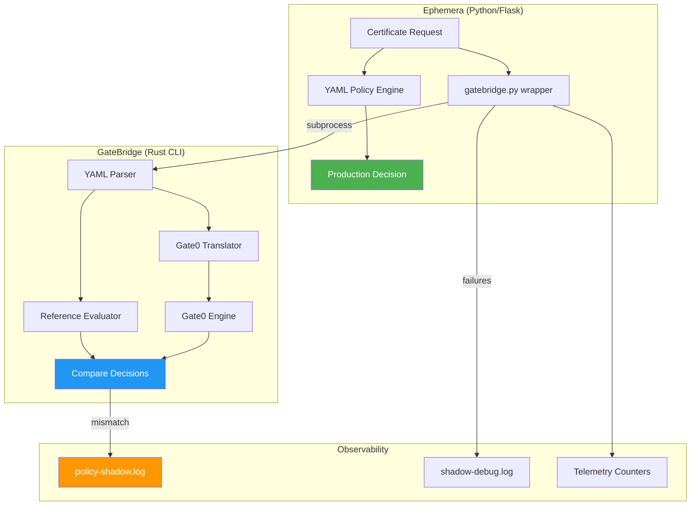

# GateBridge

YAML policy translator and shadow evaluator for [Gate0](https://github.com/Qarait/gate0).

Translates Ephemera-style YAML policies to Gate0's internal representation and provides dual-evaluation for validation.

## Status

**Phase 1 — Shadow Evaluation Only**

GateBridge is currently intended for validation, not production authorization. It runs alongside Ephemera's existing YAML engine to detect semantic mismatches.

## Installation

```bash
cd gatebridge
cargo build --release
```

Binary will be at `target/release/gatebridge`.

## Usage

```bash
# Validate policy syntax
gatebridge validate policy.yaml

# Translate to Gate0 (shows ReasonCode mapping)
gatebridge translate policy.yaml

# Shadow evaluation (dual execution)
gatebridge shadow policy.yaml request.json

# Read request from stdin
echo '{"oidc_groups": ["admins"]}' | gatebridge shadow policy.yaml -
```

### Exit Codes

| Code | Meaning |
|------|---------|
| 0 | Success (shadow: decisions match) |
| 1 | Mismatch (shadow: decisions differ) |
| 2 | Error (parse failure, etc.) |

## Known Limitations (Phase 1)

> [!WARNING]
> GateBridge uses **simplified CIDR matching** (prefix-based), not full CIDR.
> Edge cases like `/31` or `/30` networks may produce different results than
> Python's `ipaddress` module. This is intentional for Phase 1.

> [!WARNING]
> **Overnight time ranges** (e.g., `22:00-06:00`) are not supported.
> Use two separate ranges instead.

> [!WARNING]
> **ReasonCode mapping is unstable.** The mapping between policy index and
> ReasonCode may change if policies are reordered. Do not persist these values.

See [SEMANTICS.md](SEMANTICS.md) for the complete specification.

## Architecture



### Key Design Principles

| Principle | Implementation |
|-----------|----------------|
| **Observational only** | Gate0 never affects production decisions |
| **Fail-open** | CLI failures return None, never block |
| **Crash isolation** | Subprocess boundary prevents propagation |
| **Adapter pattern** | Complex matching (fnmatch, CIDR) pre-computed before Gate0 |

This keeps Gate0 pure (no fnmatch/CIDR in core) while validating semantic equivalence.

## License

MIT
